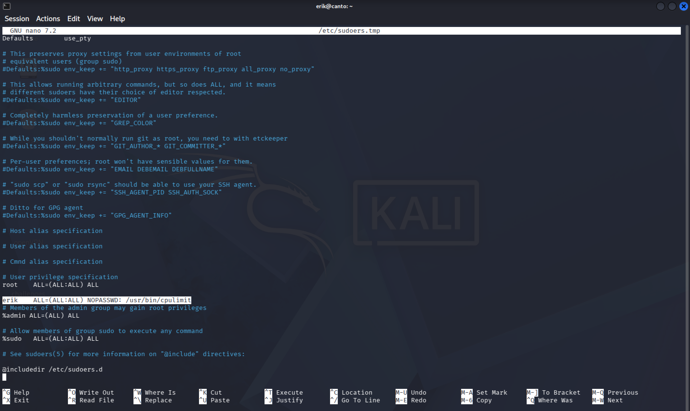
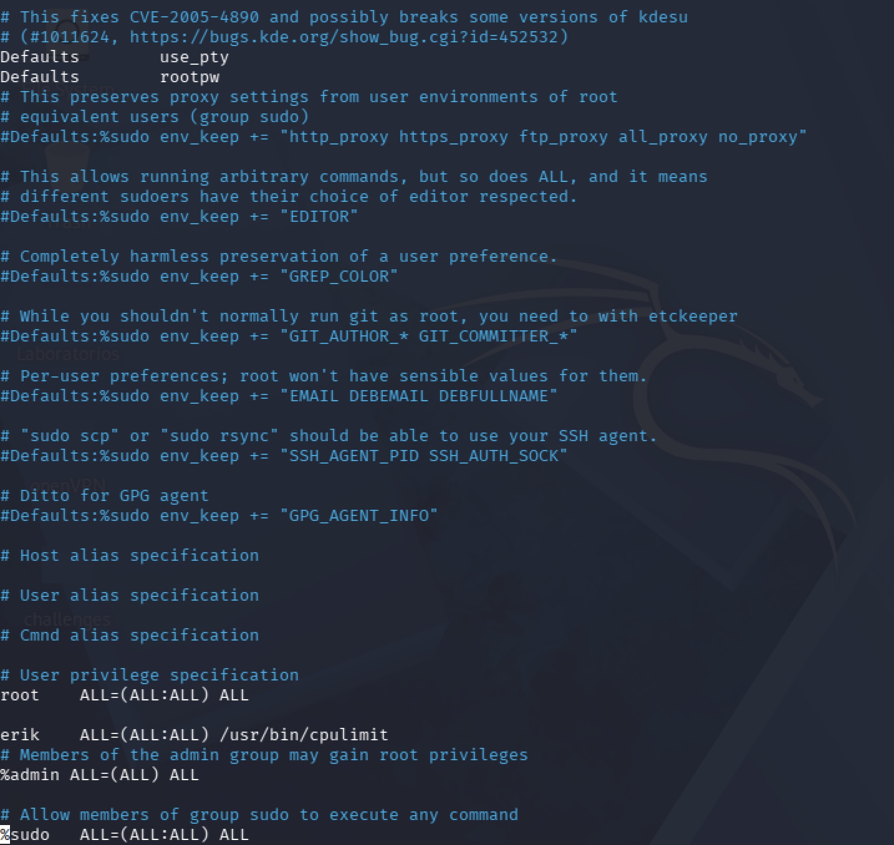
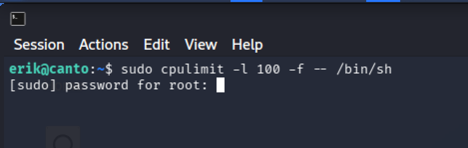

# Mitigations 🔐

For this specific scenario, there are several key configuration fixes that would have prevented this attack:
### 1) Correct update policy 💾
The initial flaw exploited was an outdated plugin version that contained known vulnerabilities. Implementing a proper update policy for WordPress core, plugins, and themes would have mitigated this issue. 

**Recommendation**: Establish a centralized update workflow or enable automatic updates. However, keep in mind that automatic updates can occasionally introduce breaking changes or compatibility issues. Therefore, it is strongly recommended to maintain a regular backup schedule and, ideally, test updates in a staging environment before applying them to production. You can find more details on how to configure automatic updates in this official [WordPress article.](https://wordpress.org/documentation/article/plugins-themes-auto-updates/) 
### 2) Properly manage sensitive information 👁️
We gained access as the user "erik" because the password was stored in plain text within a file that had read permissions for everyone. Storing passwords in plain text files is NOT recommended under any circumstances. Files containing sensitive information should be restricted so that only authorized users can access them. 

**Recommendation**: Implement a dedicated password manager for credential handling. This not only facilitates storing, retrieving, and managing strong passwords, but many password managers also enforce organizational password policies and provide alerts for periodic password rotation. 

Additionally, for files containing sensitive information that the user "erik" needs to access, proper file permissions must be set. You can learn more about file and directory permissions [here](https://www.computerhope.com/unix/uchmod.htm). 

In this specific case, the file containing Erik's password had read permissions for all users. This can be resolved easily:

1) **Only root needs access:** 

Executing as root:

```terminal
chmod 700 [filename]
```

2) **If both root and "erik" need access:**

If the file is currently owned by root:root, we first change group ownership to "erik". Executing as root:

```terminal
chown root:erik [filename]
```

With the ownership now set to owner=root and group=erik, we adjust the permissions:

```terminal
chmod 740 [filename]
```

This grants full permissions to root and read-only access to Erik, while restricting all other users.

### 3) Sudo permissions 👮‍♂️
We escalated privileges to root due to a misconfigured sudo entry with the NOPASSWD directive. Erik was permitted to run "cpulimit" as root without providing credentials, allowing us to exploit a GTFOBins vector to spawn a root shell.

**Recommendation**: 
1) Primary fix: Remove unnecessary users from the sudoers list according to the principle of least privilege. 
2) If Erik strictly requires execution rights for `cpulimit` as root, remove `NOPASSWD` and require authentication. In this scenario, where the attacker only compromises Erik's user credentials, enforcing root password verification (`Defaults rootpw`) prevents the attacker from executing the GTFOBins payload.

**Configuration Example:**



As seen in the image, the user "erik" was configured in the sudoers file with the NOPASSWD directive, enabling trivial privilege escalation. Assuming Erik strictly requires access to run `cpulimit` as root, the sudoers entry should be modified to require password authentication. Furthermore, configuring `Defaults rootpw` forces sudo to ask for the root password rather than the user's password.

To safely edit the configuration, execute as root:

```terminal
sudo visudo
```

**Note**: Always use `visudo` to edit the sudoers file, as syntax errors can lock users out of administrative access.

Add the following line under Defaults:

```editor
Defaults rootpw
```

And modify Erik's permission line:

``` editor
erik    ALL=(ALL:ALL) /usr/bin/cpulimit
```

The sudoers file should look like this:



Now, attempting to run `sudo cpulimit -l 100 -f -- /bin/sh` will prompt for the root password. Since the attacker does not possess the root password, the privilege escalation vector is effectively mitigated. 



**Note on GTFOBins:** Keep in mind that binaries like `cpulimit` allow shell execution by design. While `Defaults rootpw` stops an attacker who only holds Erik's credentials, anyone who legitimately knows the root password (or if Erik himself were a malicious insider) could still gain a full root shell through this binary. In production environments, sensitive functions should be wrapped in restricted scripts or controlled via cgroups/systemd rather than granting direct sudo rights over GTFOBins binaries.
