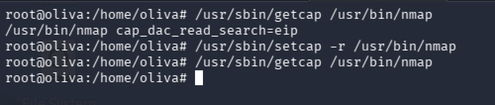
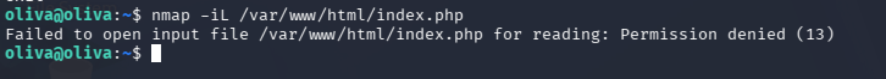

# Mitigations 🔐

> **Disclaimer:** While reviewing this mitigation plan, keep in mind that these are preventive actions designed for a vulnerable lab environment whose design is unlikely to be encountered in a real-world operational environment.

That said, for this specific scenario, several key configuration fixes would have prevented this attack:
### 1) Public exposure of sensitive files on the web server 💾
The main weakness that allowed the attack was the availability of sensitive files in the web server. Specifically, the web page contained a direct message and link:

```http
Hi Oliva, Here the pass to obtain root: CLICK!
```

Although the message mentions root, the downloaded file actually contained credentials for the `oliva` user.

The file was downloaded without the necessity of any credentials. Additionally, the message contains critical information such as the name of a possible user. This amplifies the attack surface because it enables the attacker to try brute-force attacks against a specific user or provide additional information to try social engineering, for example, writing an email to IT pretending is Oliva to reset the password.

Such a sensitive files should **never** be placed inside a web-accessible directory. While the file was encrypted, still offline cracking is possible (this was essentially what was done in the lab)

**Recommendation:** Remove all sensitive files and backups from the web root immediately. If file transfer is necessary, use specific tools for this purpose. For example, upload the file via SSH to a folder where only the users in the organization that requires such file has access.

### 2) Weak passphrases 👁️
We successfully cracked the LUKS2 encrypted file (which contained oliva's SSH password) using a brute-force tool and a standard wordlist (`rockyou.txt`) 

Using weak or predictable passphrases undermines key-based encryption, as offline brute-force tools (such as `bruteforce-luks`) can systematically test wordlists against the encrypted container until a match is found.

**Recommendation:** Enforce a strong password and passphrase policy across the organization. Passphrases should be long, complex, and unique. Additionally, plain-text password storing should be restricted, so no one can get access to a content they should not. Employing an enterprise password manager helps users generate, store, and manage strong credentials securely while enforcing periodic rotation policies.

### 3) File capabilites 👮‍♂️
We escalated privileges to `root` because we where able to access the database that stores `root` SSH password. Although the `oliva` user did not have direct read permissions for `/var/www/html/index.php`, the elevated capabilities assigned to `nmap` enabled `oliva` to bypass standard Discretionary Access Control (DAC) restrictions and disclose the file contents.

**Recommendation:**  Remove unnecessary capabilities to `nmap` binary **(Principle of Least Privilege).** Removing capabilities is very simple, as root we can use the `setcap`tool to remove the capabilities of the binary:

```terminal
setcap -r /usr/bin/nmap
```

Let's see the example with `oliva`VM:



We can see now `nmap` does not have capabilities, if we try to read again the content of `index.php`with the command `nmap -iL /var/www/html/index.php`we can see it would not allow us:



Mitigating this vulnerability would have stopped this way of privilege escalation.

### 4) Storing password in plaintext  📚

We were able to authenticate as `root` because we gathered the system administrator password from the database, where it was stored in plain text. Passwords for system accounts should never be stored in plaintext inside application databases.

**Recommendation:** Remove all system administrative credentials from database tables and web application files. Administrative access to the operating system should be managed via SSH keys or Privileged Access Management (PAM) solutions rather than static plain text passwords.